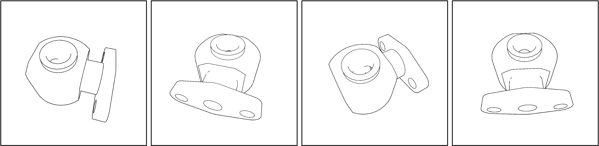
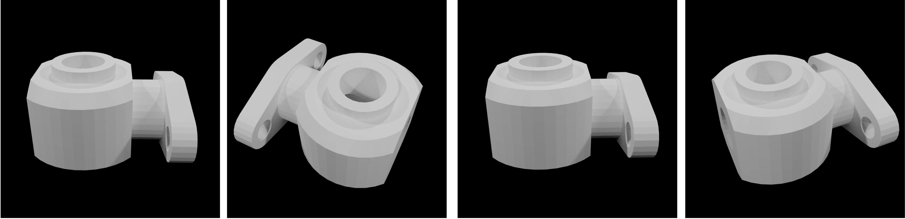
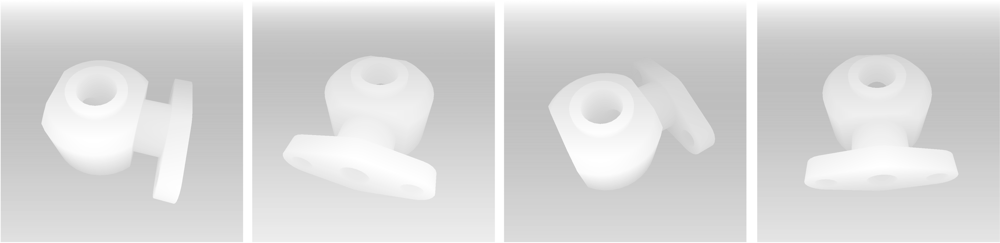
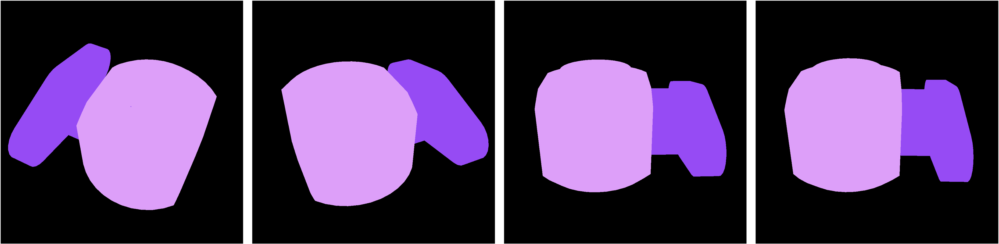

# Blender Render Engine Documentation

## 1. Installation

To set up the rendering environment, follow these steps:

1.  **Clone the repository**:
    ```bash
    git clone https://github.com/ankanbhunia/realistic-render-engine.git
    cd Blender-Render-Engine
    ```

2.  **Create and activate a Conda environment**:
    It is recommended to use a dedicated Conda environment to manage dependencies. A `conda` environment file `environment.yaml` has been provided for easy setup.
    ```bash
    conda env create -f environment.yaml
    conda activate datagen
    ```

4.  **Download and extract Blender**:
    This project specifically requires Blender version 2.93.18.
    Download the Linux x64 version of Blender 2.93.18 from the official Blender archive.

    ```bash
    wget https://download.blender.org/release/Blender2.93/blender-2.93.18-linux-x64.tar.xz && tar -xf blender-2.93.18-linux-x64.tar.xz && rm blender-2.93.18-linux-x64.tar.xz
    ```
    Ensure that the Blender executable is located at `blender-2.93.18-linux-x64/blender`.

    The final directory structure should resemble this:
    ```
    render_engine/
    ├── blender-2.93.18-linux-x64/
    │   ├── blender
    │   ├── ... (other Blender files)
    ├── assets/
    ├── utils/
    ├── install.sh
    ├── README.md
    ├── requirements.txt
    ├── render_object.py
    ├── render_func.py
    └── DOCUMENTATION.md (this file)
    ```

## 2. Usage

The core rendering functionalities are encapsulated within the `render_func.py` module. These functions allow programmatic control over the rendering process.


### `render_func.render_photorealistic_object_with_blender`

This function renders objects into photorealistic images based on a pre-generated JSON configuration file.

**Function Signature:**
```python
def render_photorealistic_object_with_blender(
    input_json: str,
    output_path: str,
)
```

**Parameters:**
*   `input_json` (str): Absolute path to the input JSON file containing the rendering configuration.
*   `output_path` (str): Absolute path to the directory where the rendered photorealistic images will be saved.

**Example Usage:**
```python
import tempfile, json
import numpy as np
import render_func

random_seed = 1000

obj_list = [{
        'obj_name': "id0",
        'obj_path': "assets/mesh/0.obj",
        'transform': np.eye(4,4).tolist(),
        'mat_path' : "assets/pbr_materials/acg_granite_005_a",
        'obj_seg_label': 1,
        }, {
        'obj_name': "id1",
        'obj_path': "assets/mesh/1.obj",
        'transform': np.eye(4,4).tolist(),
        'mat_path' : "assets/pbr_materials/acg_glazed_terracotta_001",
        'obj_seg_label': 2,
        }]

with tempfile.NamedTemporaryFile(mode='w', delete=False, suffix='.json', dir='/tmp') as temp_file:
    temp_config_file_path = temp_file.name
    json_data = render_func.create_render_json(
            obj_list=obj_list,
            visible_target_ids=['id0'],
            camera_target_ids=None,
            env_hdr_path="assets/hdr_envs/anniversary_lounge_4k.hdr",
            bg_pbr_path="assets/pbr_materials/acg_wood_082_b",
            global_pose=None,
            camera_search_space=30,
            visibility_check_enabled=True,
            num_views = 4,
            azimuth_range=(0, 360),
            distance_multiplier=(2.0, 2.1),
            elevation_range = (10, 60),
            seed = random_seed
        )

    with open(temp_config_file_path, 'w') as f:
        json.dump(json_data, f, indent=4)

print(f"Generated JSON configuration at: {temp_config_file_path}")

render_func.render_photorealistic_object_with_blender(
        input_json=temp_config_file_path,
        output_path=f"output",
    )
```
**Output:**


### `render_func.render_untextured_object_with_blender`

This function renders 3D objects without textures from multiple camera angles. It supports different output modes such as lineart, textureless, and depth maps. Each mode is rendered in a separate Blender process for isolation.

**Function Signature:**
```python
def render_untextured_object_with_blender(
    input_json: str,
    output_path: str,
    mode: list[str] = ['lineart']
)
```

**Parameters:**
*   `input_json` (str): Absolute path to the input JSON file containing object data. This JSON should define the objects to be rendered, similar to the structure expected by `create_render_json`.
*   `output_path` (str): Base directory where rendered images for each mode will be saved.
*   `mode` (list[str]): A list of rendering modes to generate. Supported modes are:
    *   `'lineart'`: Renders the object with outlines.
    *   `'textureless'`: Renders the object with flat shading, no textures.
    *   `'depth'`: Renders a depth map of the scene.
    The default mode is `['lineart']`.

**Example Usage:**
```python
import tempfile, json
import numpy as np
import render_func

random_seed = 1000

obj_list = [{
        'obj_name': "id0",
        'obj_path': "assets/mesh/0.obj",
        'transform': np.eye(4,4).tolist(),
        'obj_seg_label': 1,
        }, {
        'obj_name': "id1",
        'obj_path': "assets/mesh/1.obj",
        'transform': np.eye(4,4).tolist(),
        'obj_seg_label': 2,
        }]

with tempfile.NamedTemporaryFile(mode='w', delete=False, suffix='.json', dir='/tmp') as temp_file:
    temp_config_file_path = temp_file.name
    json_data = render_func.create_render_json(
            obj_list=obj_list,
            visible_target_ids=['id0'],
            camera_target_ids=None,
            global_pose=None,
            camera_search_space=30,
            visibility_check_enabled=True,
            num_views = 4,
            azimuth_range=(0, 360),
            distance_multiplier=(2.0, 2.1),
            elevation_range = (10, 60),
            seed = random_seed
        )

    with open(temp_config_file_path, 'w') as f:
        json.dump(json_data, f, indent=4)

print(f"Generated JSON configuration at: {temp_config_file_path}")

render_func.render_untextured_object_with_blender(
        input_json=temp_config_file_path,
        output_path=f"output",
        mode=['lineart', 'textureless', 'depth']
    )
```

**Output:**





#### `render_func.render_segmentation_object_with_blender`

This function renders objects with segmentation masks. It expects an input JSON file that defines the objects and their segmentation labels.

**Function Signature:**
```python
def render_segmentation_object_with_blender(
    input_json: str,
    output_path: str,
)
```

**Parameters:**
*   `input_json` (str): Absolute path to the input JSON file containing object data and segmentation labels. This JSON should be structured similarly to the output of `create_render_json`, including `obj_seg_label` for each object.
*   `output_path` (str): Absolute path to the directory where the rendered segmentation images will be saved.


**Example Usage:**
```python
import tempfile, json
import numpy as np
import render_func

random_seed = 1000

obj_list = [{
        'obj_name': "id0",
        'obj_path': "assets/mesh/0.obj",
        'transform': np.eye(4,4).tolist(),
        'obj_seg_label': 1,
        }, {
        'obj_name': "id1",
        'obj_path': "assets/mesh/1.obj",
        'transform': np.eye(4,4).tolist(),
        'obj_seg_label': 2,
        }]

with tempfile.NamedTemporaryFile(mode='w', delete=False, suffix='.json', dir='/tmp') as temp_file:
    temp_config_file_path = temp_file.name
    json_data = render_func.create_render_json(
            obj_list=obj_list,
            num_views = 4,
            azimuth_range=(0, 360),
            distance_multiplier=(2.0, 2.1),
            elevation_range = (10, 60),
            seed = random_seed
        )

    with open(temp_config_file_path, 'w') as f:
        json.dump(json_data, f, indent=4)

print(f"Generated JSON configuration at: {temp_config_file_path}")

render_func.render_segmentation_object_with_blender(
        input_json=temp_config_file_path,
        output_path=f"output",
    )

```
**Output:**


### `render_func.create_render_json`

This function is responsible for constructing a comprehensive JSON configuration dictionary. This dictionary serves as the primary input for the photorealistic rendering function, defining all necessary parameters for the scene, objects, and camera.

**Function Signature:**
```python
def create_render_json(
    obj_list,
    visible_target_ids=None,
    camera_target_ids=None,
    global_pose=None,
    env_hdr_path=None,
    bg_pbr_path=None,
    num_views=30,
    camera_search_space=30,
    visibility_check_enabled=True,
    azimuth_range=(0, 360),
    elevation_range=(-30, 60),
    distance_multiplier=(1.5, 2.5),
    init_dict=None,
    seed: int = None
)
```

**Parameters:**
*   `obj_list` (list): A list of dictionaries, where each dictionary describes a 3D object to be rendered. Each object dictionary can contain the following keys:
    *   `'obj_name'` (str): A unique name for the object, e.g., "id0".
    *   `'obj_path'` (str): Absolute path to the `.obj` file of the 3D model, e.g., "assets/mesh/0.obj".
    *   `'transform'` (list, optional): A 4x4 transformation matrix (list of lists) to apply to the object, e.g., `np.eye(4,4).tolist()`. If `None`, an identity matrix is used.
    *   `'mat_path'` (str, optional): Absolute path to the PBR material directory for the object, e.g., "". If `None`, no material is applied.
    *   `'obj_seg_label'` (int, optional): An integer label used for segmentation rendering, e.g., 1.
    *   `'is_visible'` (bool, optional): A boolean indicating whether the object should be visible in the render. Defaults to `True` if not specified.
*   `visible_target_ids` (list, optional): A list of `obj_name` strings. If provided, only objects with these IDs will be visible in the render.
*   `camera_target_ids` (list, optional): A list of `obj_name` strings. If provided, the camera will be focused on the bounding box center of these objects. If `None`, the camera focuses on the entire scene's bounding box.
*   `global_pose` (list, optional): A 4x4 transformation matrix (list of lists) to apply globally to the entire scene.
*   `env_hdr_path` (str, optional): Absolute path to the environment HDR (High Dynamic Range) image file for lighting the scene.
*   `bg_pbr_path` (str, optional): Absolute path to a PBR material directory to be used as the background.
*   `num_views` (int): The total number of camera views to generate for the rendering.
*   `camera_search_space` (int): Defines the search space for camera placement.
*   `visibility_check_enabled` (bool): If `True`, performs a visibility check to ensure the target objects are visible from the generated camera positions.
*   `azimuth_range` (tuple): A tuple `(min_azimuth_deg, max_azimuth_deg)` specifying the range of azimuth angles (in degrees) for camera sampling.
*   `elevation_range` (tuple): A tuple `(min_elevation_deg, max_elevation_deg)` specifying the range of elevation angles (in degrees) for camera sampling.
*   `distance_multiplier` (tuple): A tuple `(min_multiplier, max_multiplier)` used to scale the camera distance from the target. The actual distance is calculated based on the target's bounding box.
*   `init_dict` (dict, optional): A dictionary containing default rendering and camera parameters. If `None`, a default set of parameters (e.g., resolution, samples, bounces) will be used.
*   `seed` (int, optional): A random seed for reproducible camera sampling.

**Returns:**
*   `dict`: A dictionary representing the complete JSON structure ready for rendering.
